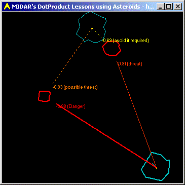



## A collision avoidance system for games using DotProduct\.

### Description

Demonstrates how to code an intelligent early warning collision detection system for a simple game of Asteroids. Uses matrix multiplication, vector maths and clearly demonstrates an excellent use for the DotProduct between two vectors. I placed this in the games section, because this is the start of a game, however I wanted to show you my debugging code before I pull it all out, as this debugging code very clearly demonstrates how to use the DotProduct between vectors. Making a good game is sometimes about Maths!
 
### More Info
 

             |
---                |---
**Submitted On**   |2003-02-13 02:16:54
**By**             |[Peter Wilson](https://github.com/Planet-Source-Code/PSCIndex/blob/master/ByAuthor/peter-wilson.md)
**Level**          |Intermediate
**User Rating**    |5.0 (40 globes from 8 users)
**Compatibility**  |VB 6\.0
**Category**       |[Games](https://github.com/Planet-Source-Code/PSCIndex/blob/master/ByCategory/games__1-38.md)
**World**          |[Visual Basic](https://github.com/Planet-Source-Code/PSCIndex/blob/master/ByWorld/visual-basic.md)
**Archive File**   |[A\_collisio1546862192003\.zip](https://github.com/Planet-Source-Code/peter-wilson-a-collision-avoidance-system-for-games-using-dotproduct__1-43343/archive/master.zip)

